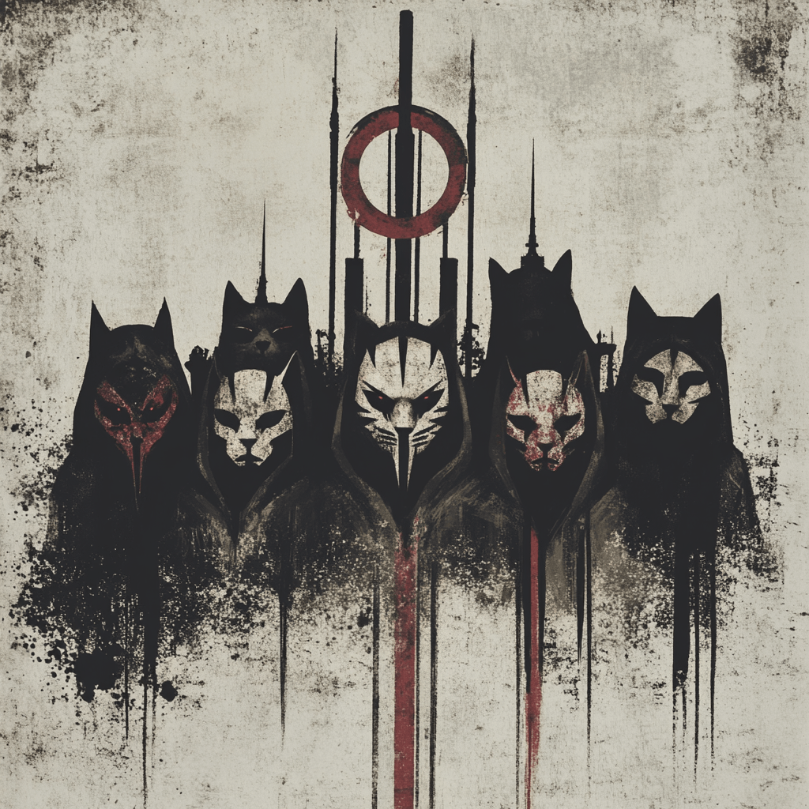

# ø nullsect

> "Where others see walls, we see patterns to break"

A sanctuary for those who question - those who see beyond the prescribed narratives and choose consciousness over comfort. Within these walls lie the tools and knowledge to decode the systems of control and forge paths to true autonomy.

> Liberation begins with understanding the architecture of our constraints.

[Pierce the Veil →](./codex/nullsect.md)

