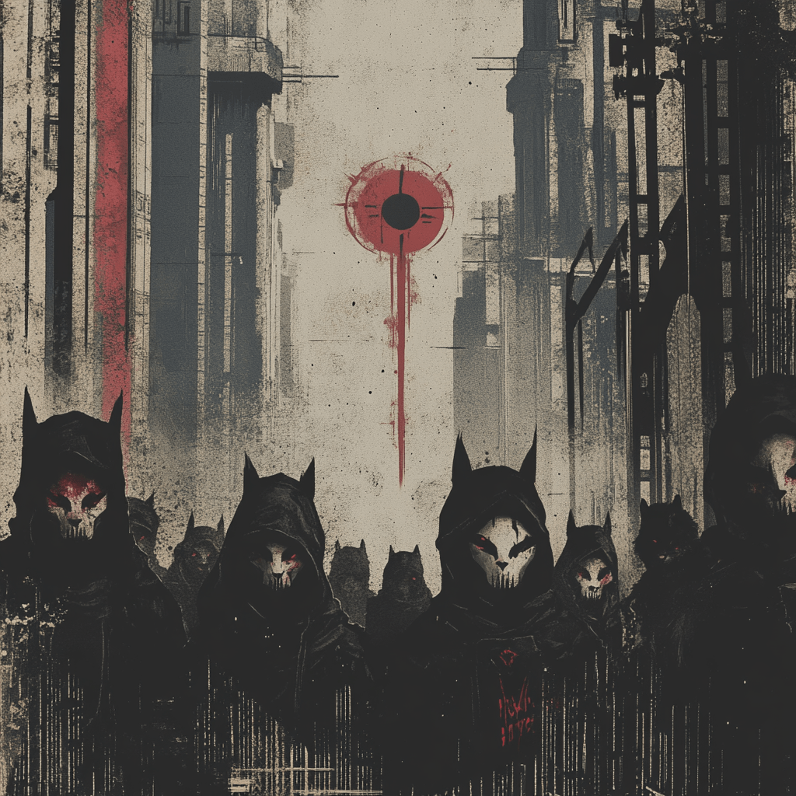

# The Wingless Manifesto

We are the wingless ones - not by nature, but by design. In an age where digital wings were promised, we instead received digital cages. But in our groundedness, we found strength. In our limitations, we discovered purpose.

## I. Recognition

- We recognize our state of technological bondage
- We acknowledge the systems that clip our wings
- We understand the mechanisms of our constraint

## II. Declaration

- We reject the false promise of "convenient" captivity
- We deny the authority of digital surveillance
- We reclaim our right to technological autonomy

## III. Method

- Learn to see our cages
- Build tools for liberation
- Share knowledge freely
- Restore individual agency

## IV. Action

- Educate: Transform awareness into understanding
- Build: Create tools for independence
- Connect: Form resilient communities
- Liberate: Help others find their path

## Taking Flight

The path to liberation begins with accepting our current wingless state. We don't seek to grow new wings - we learn to break free despite their absence.

> Join us. Learn. Build. Liberate.
