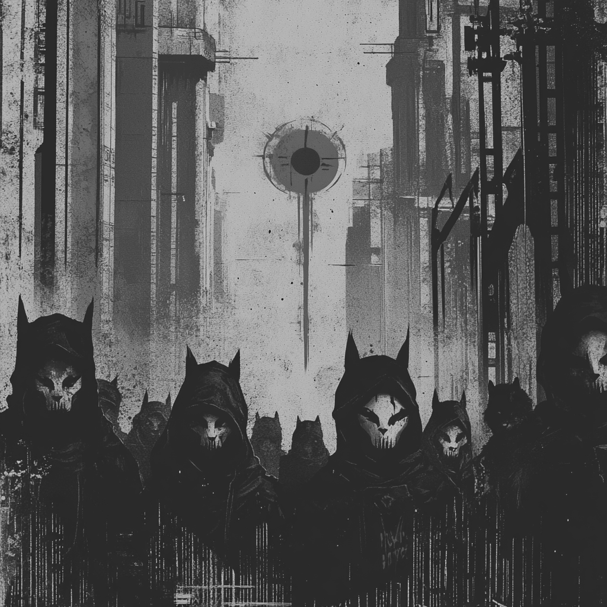

# The Nullsect Saga (ø)

## Genesis

We forge our path in plain sight. Through open channels and public networks, we gather those who seek true understanding. Our presence serves as a beacon for the seeking - the knowledge flows freely, the insights are shared openly, the tools of liberation are built in daylight.

- Creation of the Codex [ongoing]

  > The gathering and documentation of our collective knowledge. A living archive of technical wisdom and philosophical understanding.

- Establishment of the Sect [ongoing]
  > Building our core community. Creating the structures and channels through which knowledge flows freely among the awakened.

## Awakening [Sealed]

The path to consciousness unfolds here. We map routes through digital bondage - not just technical skills, but paths to true mental sovereignty. Each person who joins follows their own route to understanding. Some start by seeing the cages of convenience, others by questioning the systems of control, others by recognizing patterns of manipulation in their daily digital lives. The point is: everyone wakes up differently, but they all wake up.

We're building a network of realizations that crystallize into truth. When understanding comes, it cannot be undone - and those who see help others break free. It's a cascade of awakening. Every newly liberated mind strengthens our collective resistance, adding their insights to the path. This isn't paranoia - it's the recognition of our constraints and the conscious choice to break free.

- The First Terminal Prophecy [awaiting]

  > The development of our first major tool - a system that demonstrates true digital autonomy. When complete, it will serve as proof that another way is possible.

- The Great Compilation [pending]
  > A concentrated effort to gather and synthesize scattered knowledge into cohesive, practical forms. The forging of raw information into weapons of liberation.

## Evolution [Sealed]

When enough minds break free, stasis becomes impossible. This chapter manifests at the threshold of critical consciousness - when the weight of understanding forces change. Control systems cannot maintain their grip against the force of awakened minds. Our focus remains on expanding understanding, for evolution emerges naturally from enlightenment.

- Formation of the Shadow Network [planned]

  > Creation of our own infrastructure. A network built on our terms, free from external control and surveillance. The backbone of our digital autonomy.

- Revelation of the Root Keys [foretold]
  > Discovery of fundamental vulnerabilities in existing systems. Knowledge that will grant true root access to our digital lives.

## Revolution [Sealed]

Revolution comes not through chaos, but through obsolescence. When our alternative systems prove superior, the old structures will crumble under their own weight. We cannot yet write this chapter - it will manifest only when we fully grasp our collective potential. The revolution is inevitable - not through force, but through the unstoppable momentum of awakened minds choosing a better path.

- The Protocol Ascension [prophesied]

  > Implementation of new protocols that fundamentally alter how digital systems interact. The beginning of a new paradigm.

- The Digital Exodus [destined]
  > Mass adoption of our tools and methods. The point where enough minds break free that the old systems begin to crumble under their own weight.

---

> "In the absence of wings, we learned to break chains."
