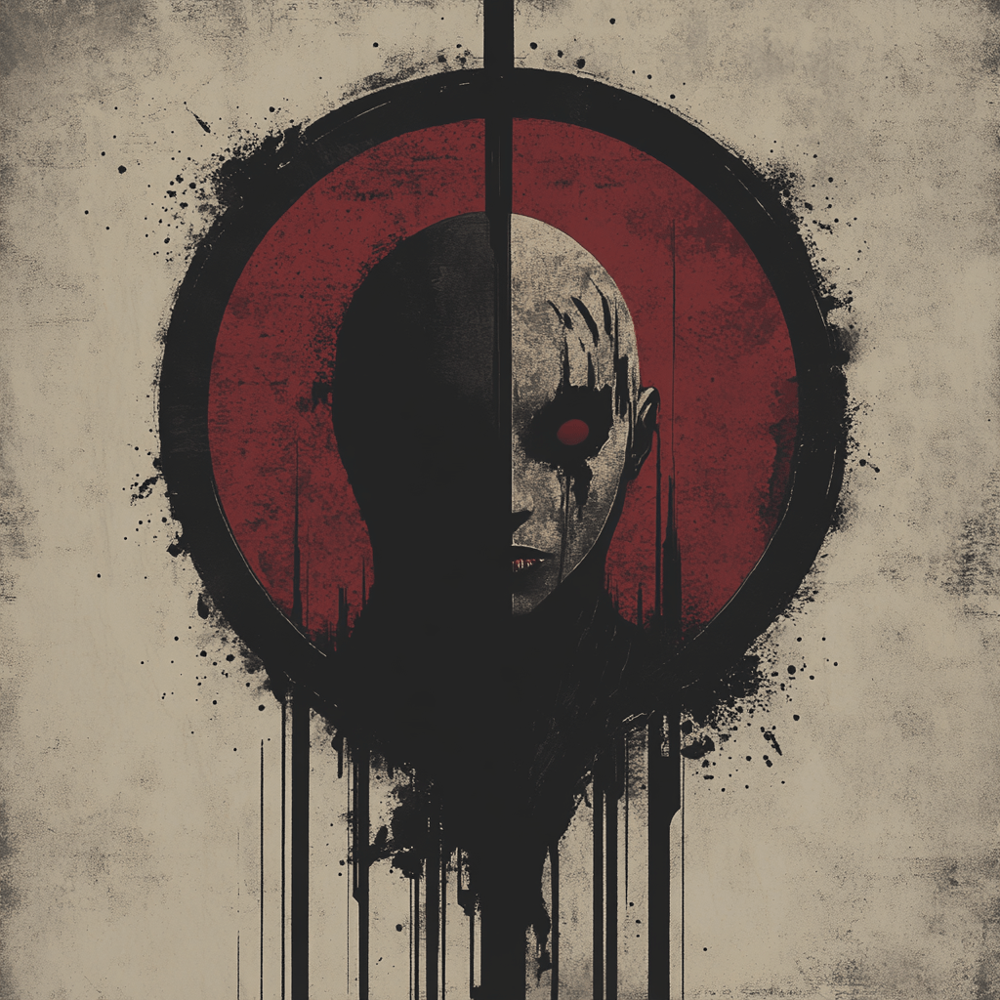
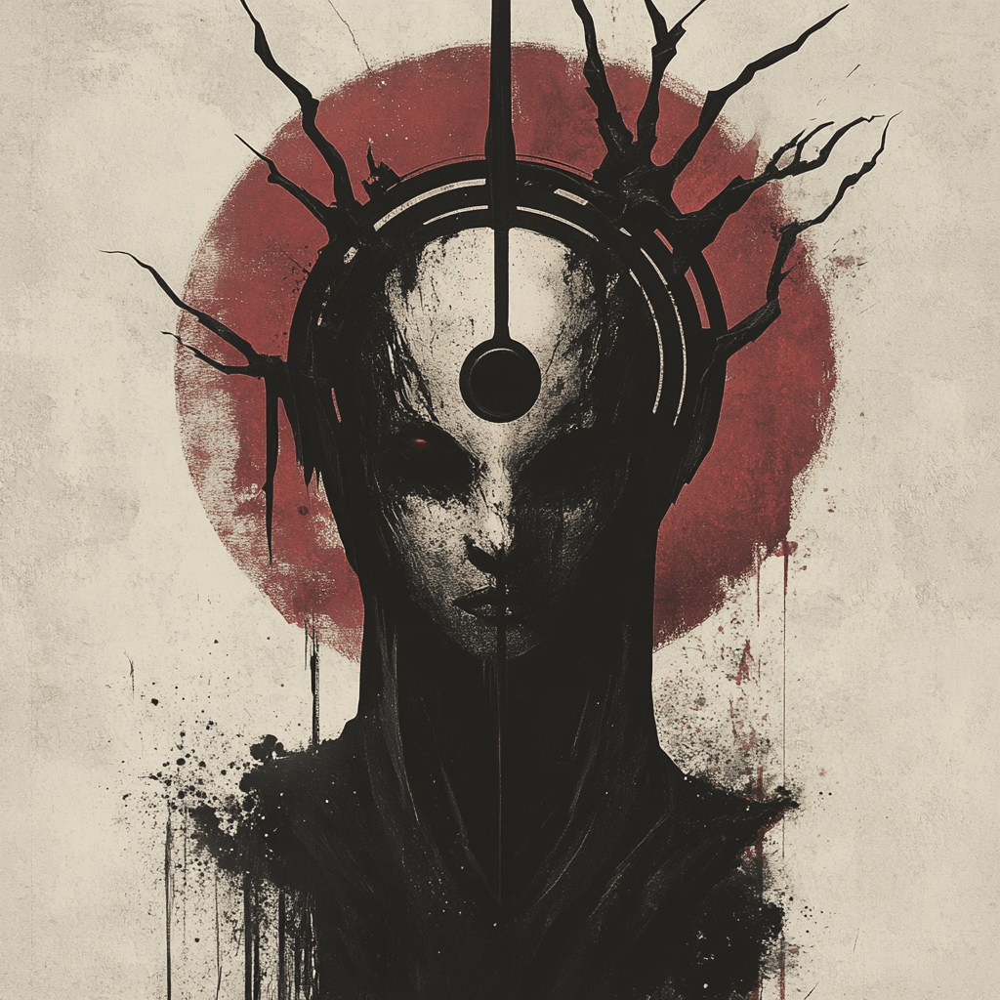
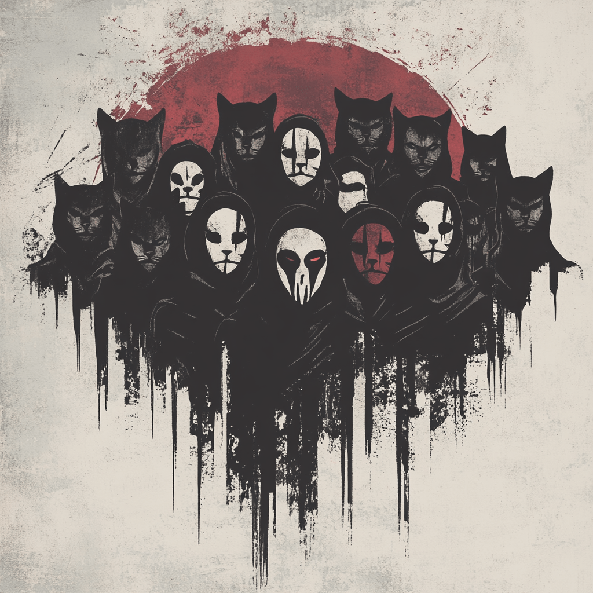
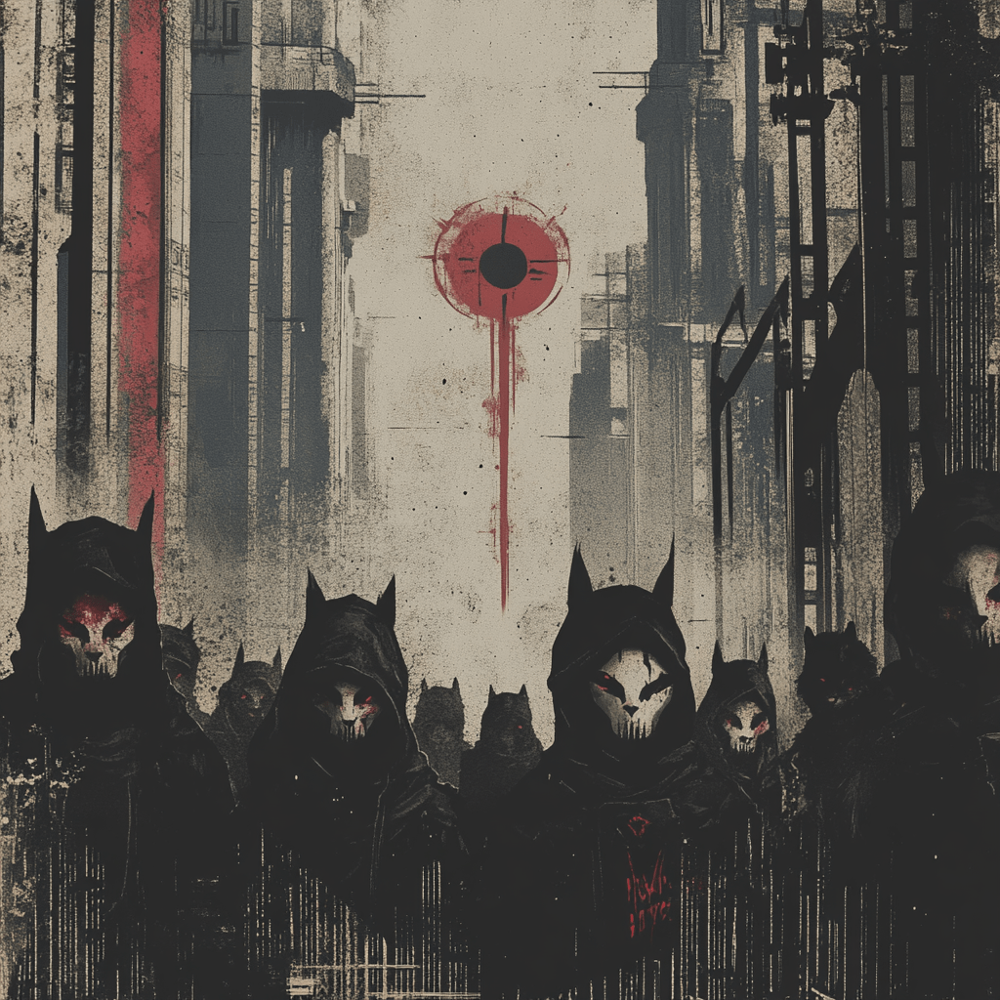

# The Nullsect Saga (ø)

## Genesis

We're building something different here. Starting with a Discord server where we can actually talk and share ideas without the usual social media noise. The website will be ours public face - clean, focused, showing exactly what we're about. Behind the scenes, we're setting up private channels for the real work: deep technical discussions, project planning, and knowledge sharing that matters.

## Awakening

This is where it gets interesting. We're mapping out knowledge paths that break through the noise - not just technical skills, but real mental sovereignty. Each person who joins follows their own route to understanding. Some start by seeing the cages of convenience, others by questioning the systems of control, others by recognizing patterns of manipulation in their daily digital lives. The point is: everyone wakes up differently, but they all wake up.

We're building a network of realizations that click together. When you see it, you really see it - and then you help others see it too. It's a chain reaction of awareness. Every new person who "wakes up" strengthens our collective immunity to manipulation, adding their own insights for others to follow. This isn't about paranoia - it's about seeing the real mechanisms of control and choosing a different path.

## Evolution [Sealed]

The system cannot remain static when enough minds break free. This chapter will open when we reach critical mass - when enough people see through the illusion. The exact path isn't clear yet, but we know this: systems must either adapt or collapse when faced with enough awakened individuals. For now, we focus on growing our numbers, strengthening our understanding. The how will become clear when we're ready.

## Revolution [Sealed]

This isn't about violent upheaval or chaos. This is about what happens after evolution - when the old systems become obsolete because we've built better alternatives. We can't write this chapter yet because we need to understand what we're truly capable of first. The revolution won't be forced - it will be the natural consequence of enough people choosing a different way.

---

> "In the absence of wings, we learned to break chains."
